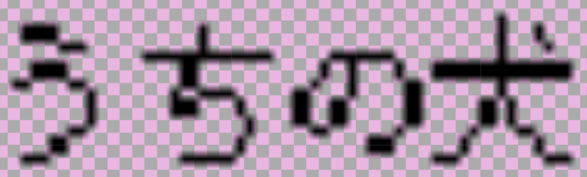
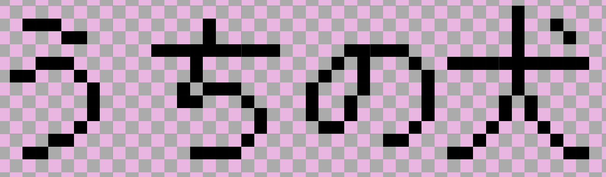

# Unity でピクセルフォントをぼやけずに表示

以下の記事の補助資料となる Unity プロジェクトです。

**[https://nekonenene.hatenablog.com/entry/unity-pixel-font-rendering](https://nekonenene.hatenablog.com/entry/unity-pixel-font-rendering)**

Unity 2019.2.12f1 で作成しました。

## Normal Scene

ふつうにフォントを使ったものです。ぼやけています。

    

## Improved Scene

記事にあるやり方で改善をはかったものです。  
ぼやけず、背景のピクセルともきれいに重なっています。

    

